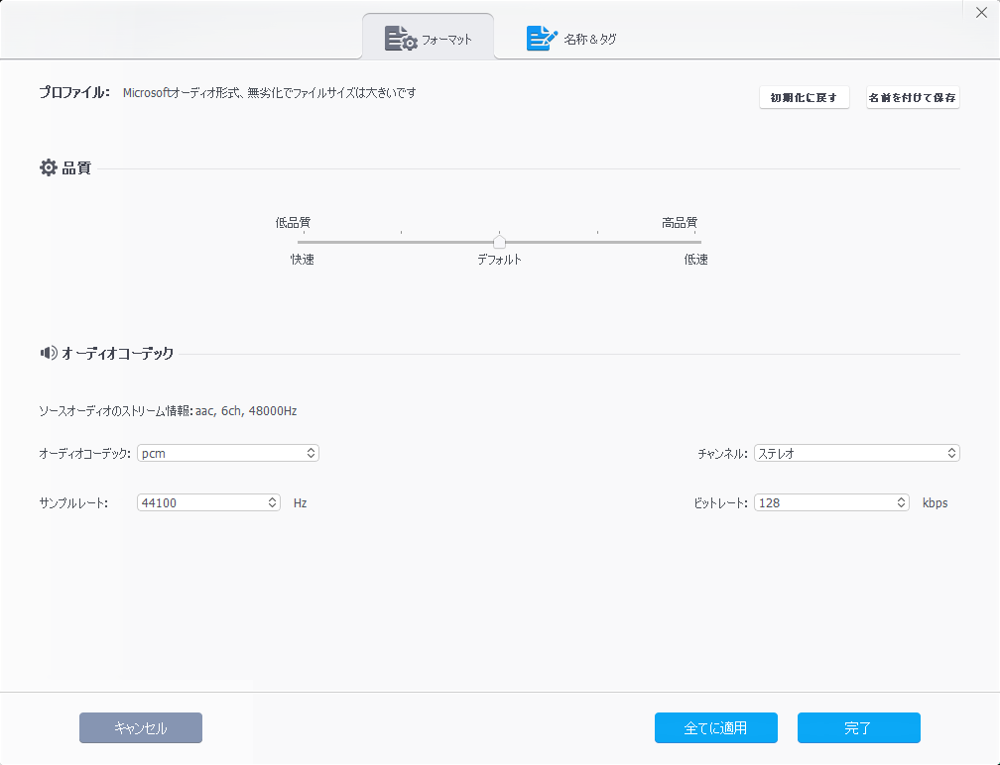
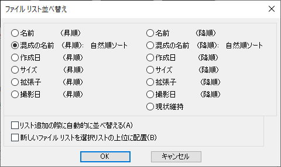
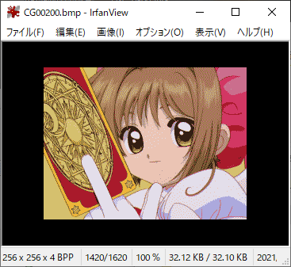

# 動画(MACSデータ)を作ってみよう！

MACSとは？
------------

#### MACSDRV.doc 引用

>MACSとはX680x0における'アニメーション'をもっと手軽に扱うために生まれた常駐型の
>アニメーションコントローラです。

## MACSデータ作成補助ツール（MACScnv.x)について
MACSデータは、プログラム(アセンブラ)＋画像データ＋音声データの組み合わせで作成します。
いかにも大変そうなので、MACSデータ作成補助ツール（MACScnv.x)を作りました。

Windows環境で画像データと音声データを抽出した後、X68000にデータをコピーします。
MACSデータ作成補助ツール（MACScnv.x)を起動し、生成されたソースとバッチファイルでMACSデータを作ります。  

また、XEiJ(X68000 Emulator in Java)を使えば、Windowsからバッチファイルを一つ実行するだけでMACSデータを作ることができます。

MACScnv.xは、画像データと音声データを用意すれば、プログラムを吐き出す仕組みになっています。
４つのバッチファイルが生成されるので、順番に実行してMACSデータを作ります。
- 0_MakeTxTp.bat　(画像処理)
- 1_MakePCM.bat　 (音声データ変換)
- 2_MakeBLK.bat　 (データ結合)
- 3_MakeMACS.bat　(アセンブル、リンク、MACSデータ作成)

### 必要な環境
WindowsとX68000間でデータのやり取りができること。
#### Windows
| No.| ツール名            | 概要                                |
|----|---------------------|-------------------------------------|
| 1  | VideoProc Converter | 動画を画像データと音声データに分解(これができるならどのツールでもよい)  |
| 2  | IrfanView           | 複数の画像データを一括で加工できる  |

#### X68000(エミュレータ推奨)
| No.| ツール名         |Version | 概要                                |所在|
|----|------------------|--------|-------------------------------------|----|
| 1  | switch.x         |        | 搭載メモリサイズを変更              |システムディスクに同梱|
| 2  | FLOATx.X         |        | 浮動小数点型(float)が扱える         |システムディスクに同梱|
| 3  | (V)TwentyOne.sys |        | 長いファイル名が扱える              |リンク参照|
| 4  | MACSDRV.x        |        | 常駐型のアニメーションコントローラ  |リンク参照|
| 5  | MakeMCS.x        |        | MACSデータ生成                      |MACS116.LZHに同梱  |
| 6  | txs.x            |        | 画像データをMACS形式で保存          |MACS116.LZHに同梱|
| 7  | blk.x            |        | バイナリを合体させる                |MACS116.LZHに同梱  |
| 8  | APICG.r          |        | 画像ローダー＆セーバー              |リンク参照|
| 9  | YGMC.X           |        | 画面モードを変更する                |リンク参照|
| 10 | HAS.x            |        | アセンブラ                          |リンク参照|
| 11 | hlk.r            |3.01+15 | リンカ                              |リンク参照|
| ~~12~~ | ~~CV.X~~             |        | ~~ファイルコンバーター~~                |~~リンク参照~~|
| 13 | pcm3pcm.x        |        | WAVからPCMへ変換する                |リンク参照|
| 14 | TS16DRVp.X       |        | XEiJ、XM6TypeG、PhantomX、060turbo、TS-6BE16 などで実装されるハイメモリ(ローカルメモリ)を扱うドライバ                 |X68K BBS|
| 15 | MACScnv.x        |        | MACSデータ作成補助                  |X68K BBS|

| No.| ファイル名       | 概要                |所在               |
|----|------------------|---------------------|-------------------|
| 1  | MACS_sch.h       | MACS用ヘッダファイル|MACS116.LZHに同梱  |

#### X68000(エミュレータ)
| No.| エミュレータ名         |Version | 概要                                |所在|
|----|------------------|--------|-------------------------------------|----|
| 1  | XEiJ (X68000 Emulator in Java)         | 0.23.01.21 | 060turboモードを使うならこれです！   |リンク参照|

### リンク

- [システムディスク](http://retropc.net/x68000/software/sharp/human302/):Makoto KamadaさんのX68000 LIBRARYのページ
- [MACSDRV](http://retropc.net/x68000/software/movie/macs/macsmoon/):Makoto KamadaさんのX68000 LIBRARYのページ
- [(V)TwentyOne](http://gorry.haun.org/x68index.html):GORRYさんの「ポリバケツＸ」...X680x0のページ
- [APICG](http://gorry.haun.org/x68index.html):GORRYさんの「ポリバケツＸ」...X680x0のページ
- [HAS](http://http://retropc.net/x68000/software/develop/as/has/):Makoto KamadaさんのX68000 LIBRARYのページ
- [hlk](https://github.com/kg68k/hlk-ev/releases/):立花@桑島技研さんのGitHub
- ~~[CV](http://retropc.net/x68000/software/develop/cv/cv_x/):Makoto KamadaさんのX68000 LIBRARYのページ~~
- [pcm3pcm.x](https://www.vector.co.jp/soft/x68/art/se019752.html):Vectorのページ
- [YGMC.X](http://most.bigmoney.biz/g0org/x68tools/graphic/conv/ygmc100.lzh):x68toolsのページ
- [TS16DRVp.X](https://x68kbbs.com/uploader/?a=Hau_miyu&f=TS16DRVp.ZIP):x68k BBS
- [XEiJ](https://stdkmd.net/xeij/):Makoto KamadaさんのXEiJ (X68000 Emulator in Java)のページ

## 手順

---
### 1. 好きな動画ファイルを準備しよう！ 
VideoProc Converterの機能が便利です。 
体験版は、５分までの制約がありますが、X68000では扱いきれないサイズなので問題ありません。(笑)

---
### 2. VideoProc Converterで動画ファイルから画像データ(PNG)を出力しよう！ 
「ビデオ」を選択します。 
 
---
下のメニューから「スナップショット」を選択します。 
 
---
「画素数」を最大値になるように上げます。※直接入力ではなく、カーソルキー↑、PageUpがオススメ 
 
---
右下の「出力フォルダ」で適当な場所を選択し、「RUN」を押して画像を抽出します。 
 
---
PNGファイルが抽出されます。 
 

---
### 3. VideoProc Converterで動画ファイルから音声データ(WAV)を出力しよう！ 
下のメニューから「PCM」を選択します。 
 
---
オプションの変更は不要です。
 
---
WAVファイルが作成されるので、複製を作り「AD.WAV」にファイル名を変更ください。 
 

---
### 4. リサイズ＆減色＆PNG→BMP変換しよう！ 
PNGファイルのどれか一つを「IrfanView」で開きます。 
 
---
「ファイル」→「一括処理」 
 
---
「形式設定」→ BMP - Windows Bitmap 
「リネーム設定」→「CG#####」 #は５個 
「ファイル管理フォルダ」 →「変換後のファイルが保存されるところ」 
「ファイルの場所」→「PNGファイルが保存されている場所」 
「ファイルの種類」→ 「PNG - Portable Network Graphics 」 
 
---
「詳細設定」を押す 
「開始番号」→ 0（10000でもOKです。） 
「加算数」 → 1 
 
---
「追加設定」を押す 
 
---
「サイズ変更」にチェックを入れる 
「横サイズ」256（MACSデータが256ｘ256なので） 
「縦サイズ」未入力  
「アスペクト比を維持する 」にチェックを入れる 
「画像をリサンプルする」にチェックを入れる 
「表示色変更」にチェックを入れる 
「設定の色数へ表示色変更」→8〜15 
※注意：16にすると後工程のパレット作成で失敗してしまいます。 
※参考：より高画質を求めるならば別の減色ツールをオススメします。 
「キャンバスサイズ変更」にチェックを入れる 
 
「設定の作業順序で編集」にチェックを入れ「順位設定」すれば一連の作業を指示順に実行することができます。  
※表示色変更は必ず最後に行うこと 
 
「設定確認」を押す
「Method1」の「Top side」「Bottom side」を広げる 
今回の例だと 256x192のサイズから68用に256x256にサイズを変更するには、 
高さが足りてないので上下32ピクセル（式(256-192)/2）ずつ余白を増やす。 
「Canvas Color」は、黒にしておきましょう。 
 
設定が完了したらOKを押してください。
---
「ファイル管理フォルダ」 →「変換後のファイルが保存されるところ（X68000側からも見えるところを設定）」 
「ファイルの場所」→「リサイズ、減色したBMPファイルが保存されている場所」 
「すべて追加」を押して「作業ファイルの数」に登録する。 
 
---
「すべて追加」を押して「作業ファイルの数」に登録する。 
「並べ替え」を押して、「混成の名前」を選択し、ファイル名が１から順番に並ぶようにする。 
 
---
「実行」を押す。 
 
---
256x256サイズで、4BPP(16色以下)の画像が出来上がる。 
 

---
### 5. MACSデータ作成補助ツール（MACScnv.x)を実行する前に確認しよう 
X68000のエミュレータを060turboモードで起動して、変換したBMP、AD.PCMが見れるか確認する。 
MACS_SCH.h、__Clean.bat、xeijwin.dllをコピーしておく。 
MACScnv.xをはじめ、変換で必要なツールは、パス設定があるところに配置しておく。 
 

---
### 6. MACSデータ作成補助ツール（_MakeMACS_Win_And_XEiJ.bat)を実行しよう！（自動でやる場合） 
Windowsから「_MakeMACS_Win_And_XEiJ.bat」を実行する。 
 
---
バッチファイルが実行される様子。 
 

---
CGxxxxx.bmpファイルは、サブディレクトリ毎に格納される 
 

---
X68000(XEiJ)から見た様子 
 

---
用意が出来たら、引き続きキーを押して、バッチファイルを継続します。 
 

---
XEiJを経由して、X68000のコマンドプロンプトに命令が飛びます。 
 
後は、２時間ぐらい眺めておくだけで完成です。 

---
# おわり（自動でやる場合）→ ８章へGO！
---
### 7. MACSデータ作成補助ツール（MACScnv.x)を実行しよう！（手動でやる場合） 
MACSデータ作成補助ツール（MACScnv.x)を実行する。 
例１ 
＜第一引数 開始番号＞ ex. 0ならCG00000が最初の画像になる 
＜第二引数 増加値  ＞ ex. 1ならCG00000、CG00001、CG00002、CG00003と+1ずつ処理する。 
＜第三引数 終了番号＞ ex. 1620ならCG01620まで処理対象となる。 
＜第四引数 動画の再生時間 or 動画の音声の再生時間＞ ex. 1分21秒の動画なら81秒なので81と入力する。 
1621枚の画像を使って、1秒あたり20枚の画像を書き換えるようなMACSデータができます。(要：メモリ） 

例２ 
＜第一引数 開始番号＞ ex. 0ならCG00000が最初の画像になる 
＜第二引数 増加値  ＞ ex. 4ならCG00000、CG00004、CG00008、CG00012と+4ずつ処理する。 
＜第三引数 終了番号＞ ex. 1620ならCG01620まで処理対象となる。 
＜第四引数 動画の再生時間 or 動画の音声の再生時間＞ ex. 1分21秒の動画なら81秒なので81と入力する。 
405枚(1621÷4)の画像を使って、1秒あたり5枚の画像を書き換えるようなMACSデータができます。 
 
バッチファイル４つとバイナリファイルリスト３種類、アセンブラソースが作成される。 
 
既にファイルが存在する場合は、上書きしません。 
__Clean.batを実行して、生成物を削除してください。
 
0_MakeTxTp.batを実行して、MACSデータに必要な画像を作ります。
 
BMP画像をテキスト画像に変換している様子 
 
1_MakePCM.batを実行して、WAVファイルをADPCMのデータに変換します 
 
変換してる様子 
 
2_MakeBLK.batを実行して、バイナリファイル結合をします 
 
ワーニングメッセージは気にしなくてよい感じ 
 
3_MakeMACS.batを実行して、アセンブル、リンク(コンバート)、MACSデータ化を行います 
 
Out of memoryが出ると失敗です 
メモリが足りないこと~~、もしくは、ファイルサイズが8MBに収まってないこと~~が原因です。 
対策１：常駐物を減らしてメモリの空き領域を増やす 
対策２：MACScnv.xの第二引数の数値を見直しフレームレートを落とす 
対策３：3_MakeMACS.bat内のhlk.rをハイメモリで実行する。※8MB以上のMACSデータを作る場合必須 
 
 ＜ハイメモリを使い方＞ 
  3_MakeMACS.batを機種にあわせて**太字**を追記編集ください 
 * Xellent30の場合 + 拡張メモリの場合 
**検証中（できないかも）** 
 * X68030 + 拡張メモリの場合 
**検証中（できないかも）** 
 * 040 turboの場合 
**検証中（できないかも）** 
 * 060 turboの場合（PhantomX、XEiJを含む） 
`has -u MACSsrc` 
**`060high.x 1`** 
 `hlk -r MACSsrc LIST0_Tx (中略) LIST_PCM` 
**`060high.x 0`** 
`MakeMCS MACSsrc` 

上記対策で、解決しない場合は、__Clean.batを実行してX68000で行う作業から、リトライしましょう！（これが辛い…） 
 

---
### 8. 再生してみよう！ 
MACSDRV.xを常駐させた後に、コマンドラインで以下を実行してください。 
※ファイル名（MACSsrc.MCS）は、適当にリネームしておくといいでしょう。 

\>copy MACSsrc.MCS MACS 
※メインメモリが足りない場合は、030モード移行でハイメモリに対応したMACSplay.xをお使いください。 
 

動画が再生できたら完成です！
 
---
# おわり